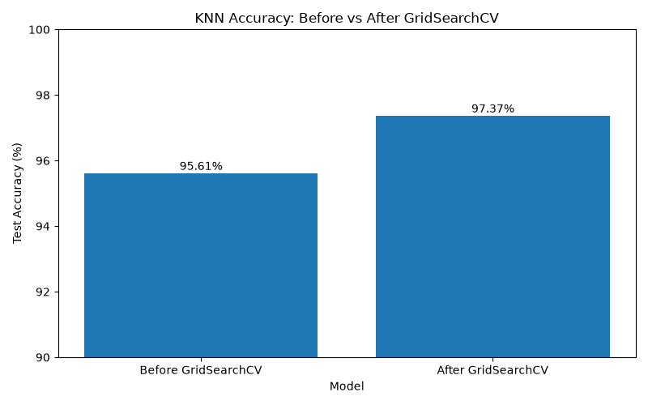
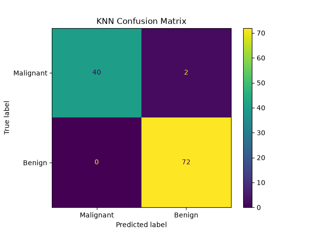

# KNN Classification

A machine learning classification project using **K-Nearest Neighbors (KNN)** and the Breast Cancer Wisconsin dataset from Scikit-learn.

## 📌 Project Overview

In this project, I built a KNN classification model to classify breast cancer tumors as **malignant** or **benign**.

The project includes:

* Exploratory Data Analysis (EDA)
* Train/Test Split
* Feature Scaling with `StandardScaler`
* KNN Classification
* Cross-Validation
* Hyperparameter Tuning with `GridSearchCV`
* Model Evaluation
* Before vs After performance comparison

## 📊 Dataset

The dataset is provided by `scikit-learn` using `load_breast_cancer()`.

* **Samples:** 569
* **Features:** 30
* **Target:** Binary classification

  * `0` → Malignant
  * `1` → Benign

## 🛠️ Technologies

* Python
* Pandas
* Matplotlib
* Scikit-learn

## 🔄 Workflow

```text
Load Dataset
      ↓
EDA
      ↓
Train/Test Split
      ↓
StandardScaler + KNN Pipeline
      ↓
Initial KNN Model
      ↓
Cross-Validation
      ↓
GridSearchCV
      ↓
Final Tuned Model
      ↓
Model Evaluation
```

## 🤖 Model

The KNN model was implemented using a Scikit-learn `Pipeline`:

```python
Pipeline([
    ("scaler", StandardScaler()),
    ("classifier", KNeighborsClassifier())
])
```

Using a pipeline ensures that feature scaling is handled correctly during Cross-Validation and GridSearchCV.

## 🔍 Hyperparameter Tuning

`GridSearchCV` was used to find the best values for:

* `n_neighbors`
* `weights`

Search space:

```python
{
    "classifier__n_neighbors": [3, 5, 7, 9, 11, 13, 15],
    "classifier__weights": ["uniform", "distance"]
}
```

### Best Parameters

```text
n_neighbors: 3
weights: uniform
```

The best Cross-Validation accuracy was approximately:

**96.92%**

## 📈 Model Performance

### Before GridSearchCV

**Test Accuracy: 95.61%**

### After GridSearchCV

**Test Accuracy: 98.25%**

### Improvement

**+2.64 percentage points**

## 📊 Before vs After GridSearchCV


## 📋 Final Model Evaluation

The final tuned model was evaluated using:

* Accuracy
* Confusion Matrix
* Precision
* Recall
* F1-score

The final test accuracy reached **98.25%**.

## 🚀 How to Run

Clone the repository:

```bash
git clone https://github.com/your-username/knn-classification.git
```

Install the dependencies:

```bash
pip install -r requirements.txt
```

Run the project:

```bash
python knn_model.py
```

## 📌 Conclusion

This project demonstrates how KNN classification can be combined with feature scaling, Cross-Validation, and GridSearchCV to build and tune a machine learning model.

The tuned model achieved **98.25% test accuracy** on the test set.


## 📊 Before vs After GridSearchCV




## 📋 Confusion Matrix



